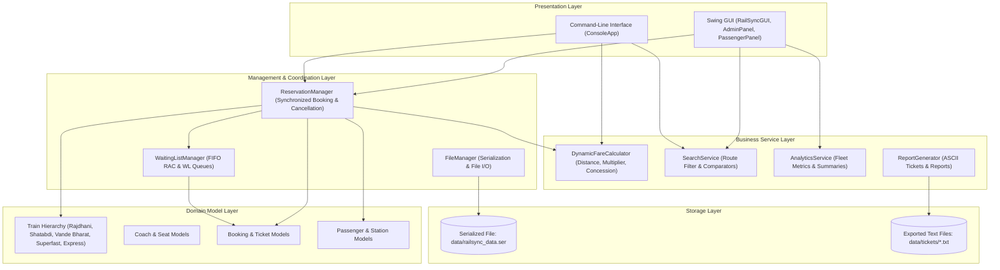
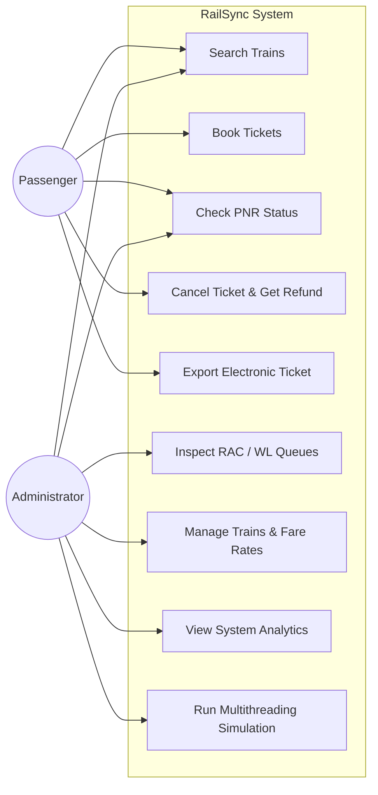
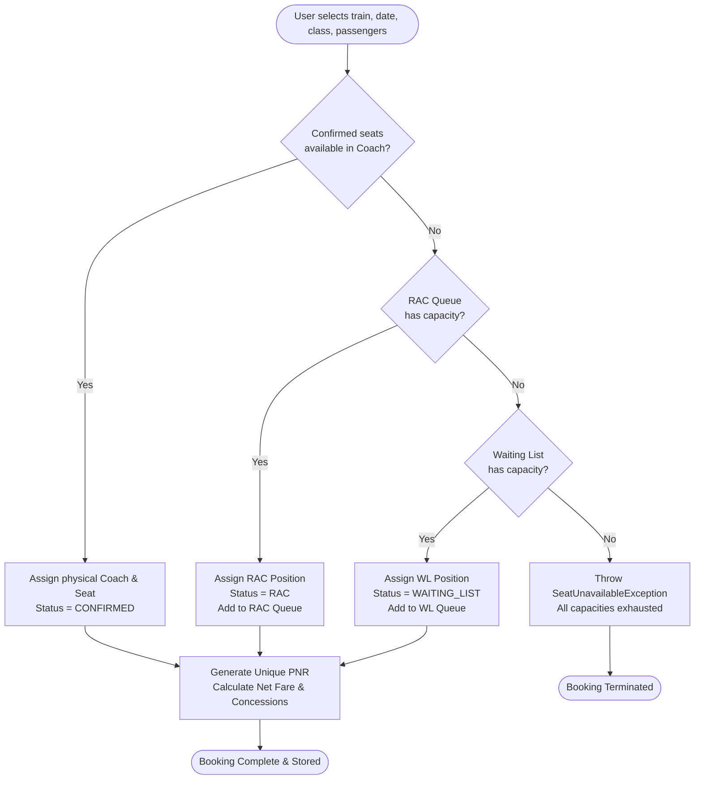
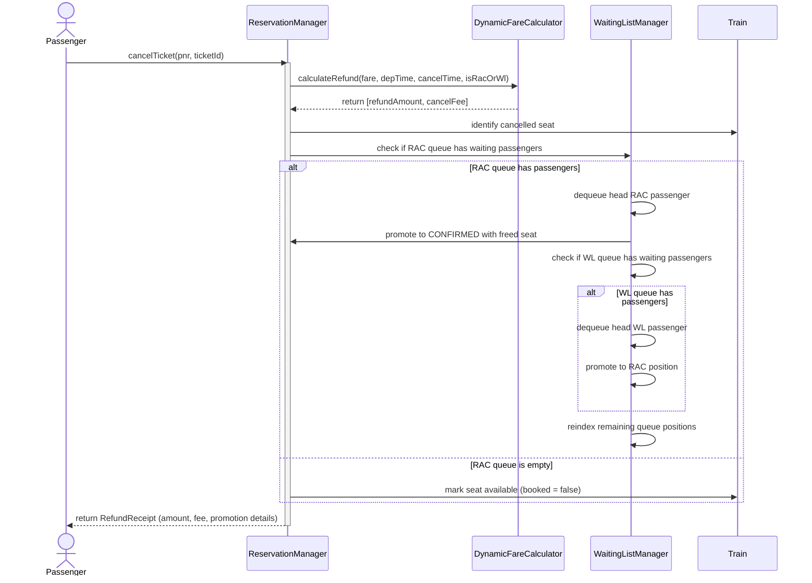
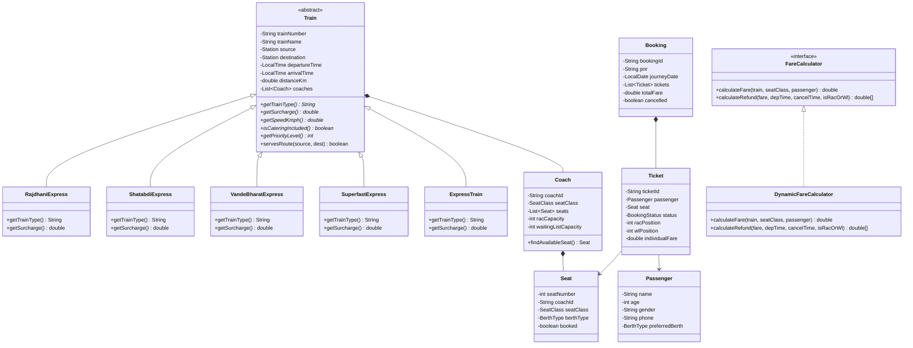
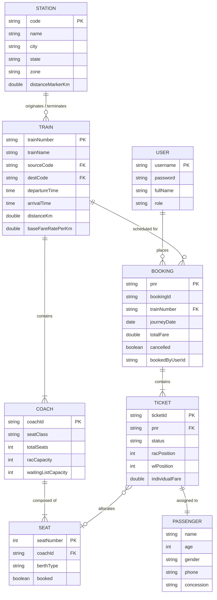

# Project Report: RailSync – Train Reservation System

---

## 1. Cover Page

**Project Title:** RailSync – Train Reservation & Dynamic Seat Management System  
**Course Name:** Programming in Java  
**Academic Program:** Bachelor of Technology  
**Project Category:** Desktop Application Development  
**Primary Language:** Core Java (JDK 17+)  
**GUI Framework:** Java Swing (`javax.swing`, `java.awt`)  
**Storage Mechanism:** Java Object Serialization (`java.io.Serializable`) & Text Stream I/O  

---

## 2. Introduction

Railway passenger reservation systems are among the most critical computerized transaction systems. They must handle high passenger volumes, enforce strict capacity limits across diverse coach classes, manage waiting queues, process ticket cancellations, and calculate distance-based fares with statutory concessions.

**RailSync** is a desktop application written in Core Java that simulates the complete operational workflow of a modern railway reservation system. The system models train route discovery, multi-passenger booking transactions, seat assignment across coach classes, dynamic queuing for **Reservation Against Cancellation (RAC)** and **Waiting List (WL)**, automated cascade promotions upon cancellations, ticket refund calculation, and multithreaded booking synchronization.

The application provides dual user interfaces: an interactive command-line interface (CLI) for terminal environments and a graphical user interface (GUI) built with Java Swing.

---

## 3. Problem Statement

Conventional introductory programming projects often oversimplify railway ticketing into an integer counter decrement. In practice, railway reservation systems face several technical complexities:

1. **Multi-State Seat Allocation**: A reservation request cannot merely be accepted or rejected; it transitions dynamically from Confirmed berths to shared RAC seats, and subsequently to Waiting List positions based on coach capacity.
2. **Cancellation Promotion Cascade**: When a passenger cancels a confirmed ticket, the system must not leave the seat vacant if other passengers are waiting. It must automatically promote the first RAC passenger to Confirmed, allocate the vacated physical berth, and promote the first Waiting List passenger to RAC.
3. **Concurrency and Race Conditions**: When multiple users attempt to book tickets on the same train simultaneously, concurrent thread execution can lead to race conditions where two passengers are assigned the same physical seat (double-booking).
4. **Fare Computation Rules**: Ticket prices vary dynamically based on train category, travel distance, coach class multipliers, and passenger concessions (e.g. senior citizen discount, infant travel).
5. **State Persistence**: System state—train catalogs, station networks, active bookings, and waiting queues—must persist across application restarts without data corruption.

---

## 4. Functional Requirements

- **FR1: Train Route & Schedule Search**: Passengers can search for trains by specifying source and destination stations, journey dates, and preferred travel classes.
- **FR2: Multi-Passenger Ticket Booking**: Users can book tickets for 1 to 6 passengers in a single transaction, capturing name, age, gender, phone number, and berth preferences.
- **FR3: Dynamic Seat & Queue Assignment**: The system assigns confirmed berths if available. When confirmed seats are exhausted, it routes requests into an RAC queue, then into a Waiting List queue, and finally issues a regret notification when all capacities are full.
- **FR4: Ticket Cancellation & Automated Cascade**: Passengers can cancel bookings using their PNR. The system marks the ticket cancelled, issues a refund voucher with time-tiered deductions, promotes the leading RAC passenger to Confirmed, and promotes the leading Waiting List passenger to RAC.
- **FR5: PNR Status Enquiry**: Passengers can check real-time ticket status (Confirmed with berth number, RAC with queue position, or Waiting List with WL number).
- **FR6: Ticket & Summary Report Export**: The system generates formatted electronic reservation slips (tickets) and administrative summary reports as text files.
- **FR7: Fleet & Station Management**: Administrators can add new trains, update base fare rates, remove decommissioned trains, and inspect live queues.
- **FR8: Multithreaded Booking Simulation**: Evaluators and administrators can launch concurrent worker threads to demonstrate thread-safe seat allocation and prove zero duplicate seats.

---

## 5. Non-Functional Requirements

- **NFR1: Data Consistency & Thread Safety**: All shared train seat inventories are protected using Java synchronization (`synchronized` blocks) to guarantee mutual exclusion and prevent race conditions.
- **NFR2: Zero External Dependencies**: Built entirely with standard Java SE libraries (`java.util`, `java.time`, `java.io`, `javax.swing`). No external web frameworks, application servers, or Maven/Gradle plugins are required.
- **NFR3: Portability**: Runs consistently across Windows, Linux, and macOS platforms on any standard JDK 17 or newer runtime.
- **NFR4: Dual-Interface Accessibility**: Fully operable through an interactive CLI console as well as a Swing graphical window.
- **NFR5: Robust Exception Handling**: Implements a dedicated custom exception hierarchy (`RailSyncException`) to handle business errors gracefully without application crashes.

---

## 6. System Architecture

RailSync follows a layered architectural design where presentation components, coordination managers, business calculation services, and domain entities are separated:



---

## 7. Design Diagrams

### 7.1 Use Case Diagram



### 7.2 Workflow Diagram: Ticket Booking



### 7.3 Sequence Diagram: Cancellation & Cascade Promotion



### 7.4 Class / Component Diagram



### 7.5 Entity / Storage Relationship Diagram



---

## 8. Design Decisions & Rationale

1. **Pure Core Java vs. Frameworks**:
   - *Decision:* Build the entire application using standard Java SE (JDK 17+).
   - *Rationale:* The goal of a "Programming in Java" course project is to demonstrate direct understanding of language mechanics: thread creation, monitor locks, custom exception handling, collections manipulation, and graphical event handling, rather than relying on framework abstractions.

2. **Java Object Serialization for State Persistence**:
   - *Decision:* Use `ObjectOutputStream` and `ObjectInputStream` to save and restore `ReservationManager` state in `data/railsync_data.ser`.
   - *Rationale:* Preserves object references, polymorphic train subclass instances, coach berth hierarchies, and active waiting queues directly without requiring an external relational database server to be installed and configured.

3. **Fine-Grained Monitor Locking (`synchronized (train)`)**:
   - *Decision:* Synchronize ticket booking blocks specifically on the target `Train` instance rather than synchronizing the entire `ReservationManager` method.
   - *Rationale:* If the whole manager method were synchronized, a booking on Train 12952 (Mumbai Rajdhani) would lock the entire application, preventing another user from booking Train 22436 (Vande Bharat). Synchronizing per train provides concurrency isolation: bookings on different trains run in parallel, while bookings on the same train are thread-safe.

4. **FIFO Queuing with `LinkedList`**:
   - *Decision:* Use `java.util.LinkedList` implementing the `Queue` interface for RAC and Waiting List queues.
   - *Rationale:* Railway queues require strict First-In-First-Out (FIFO) ordering. `LinkedList` provides $O(1)$ constant time insertion at the tail and extraction from the head.

5. **Java Swing for Desktop GUI**:
   - *Decision:* Use Swing (`javax.swing`, `java.awt`) for the graphical interface.
   - *Rationale:* Swing is bundled natively with the JDK desktop module, requiring no extra dependencies. Its `CardLayout` and standard components (`JTable`, `JTabbedPane`, `JSpinner`, `SwingWorker`) provide a responsive user interface.

---

## 9. Implementation Details

### Package Structure
- `com.railsync`: Contains `Main.java` (application bootstrap) and `TestRunner.java` (automated test suite).
- `com.railsync.model`: Contains domain entities (`Train`, `Coach`, `Seat`, `Booking`, `Ticket`, `Passenger`, `Station`, `User`, `RefundReceipt`, `SeatClass`, `BerthType`, `BookingStatus`).
- `com.railsync.service`: Contains calculation and reporting logic (`FareCalculator`, `DynamicFareCalculator`, `SearchService`, `AnalyticsService`, `ReportGenerator`).
- `com.railsync.manager`: Coordinates core state (`ReservationManager`, `WaitingListManager`, `FileManager`).
- `com.railsync.thread`: Multithreading simulation classes (`BookingTask`, `ConcurrencySimulation`).
- `com.railsync.exception`: Checked exceptions (`RailSyncException`, `SeatUnavailableException`, `InvalidPNRException`, etc.).
- `com.railsync.util`: Static helpers (`ValidationUtils`, `PNRGenerator`, `SampleDataSeeder`).
- `com.railsync.gui`: Swing presentation layer (`RailSyncGUI`, `AdminPanel`, `PassengerPanel`, `ConcurrencySimulationPanel`, `LoginDialog`, `ModernTheme`).
- `com.railsync.cli`: Command-line presentation layer (`ConsoleApp`).

### Core Algorithms

#### 1. Dynamic Seat Allocation Algorithm
When a passenger booking request arrives:
1. The target train is locked using `synchronized(train)`.
2. The coach matching the requested `SeatClass` is scanned for an unbooked physical seat.
3. If an unbooked seat exists, it is marked booked, assigned to the ticket, and status is set to `CONFIRMED`.
4. If physical seats are full, the system checks the RAC queue. If RAC capacity has space, the ticket status is set to `RAC` with position `racQueue.size() + 1` and enqueued.
5. If RAC is full, the system checks the Waiting List queue. If WL capacity has space, status is set to `WAITING_LIST` with position `wlQueue.size() + 1` and enqueued.
6. If the Waiting List is also full, a `SeatUnavailableException` is thrown.

#### 2. Cancellation and Queue Promotion Cascade
When a confirmed ticket is cancelled:
1. The ticket is marked cancelled and the departure time is evaluated against cancellation time to calculate refund deductions.
2. If the RAC queue has passengers, the head ticket is dequeued and promoted to `CONFIRMED`, taking the vacated physical seat.
3. If the Waiting List queue has passengers, the head WL ticket is dequeued, promoted to `RAC`, and appended to the RAC queue.
4. Remaining queue positions are updated sequentially.
5. If the RAC queue was empty, the physical seat is returned to the unbooked pool.

---

## 10. Screenshots / Results

### A. Terminal CLI Interface
```text
==================================================================
        RailSync – Interactive Command-Line Console Application   
               Core Java Train Reservation System                 
==================================================================
------------------------- MAIN MENU ------------------------------
  1. Search Trains (by Source & Destination)
  2. View All Trains Catalog
  3. Book Train Ticket
  4. PNR Status Enquiry
  5. Cancel Ticket (with Promotion Cascade & Refund)
  6. View RAC & Waiting List Queue Status
  7. Dynamic Fare & Concession Calculator
  8. Save System State to Disk
  9. Exit
------------------------------------------------------------------
Enter your choice (1-9):
```

### B. Generated Electronic Reservation Slip (Ticket)
```text
========================================================================================
                       INDIAN RAILWAYS - ELECTRONIC RESERVATION SLIP                     
                                POWERED BY RAILSYNC SYSTEM                               
========================================================================================
 PNR NUMBER       : RS497051              BOOKING ID    : BK10001
 TRAIN NO & NAME  : 22436 Vande Bharat    TRAVEL CLASS  : AC Chair Car (CC)
 FROM STATION     : New Delhi (NDLS)      TO STATION    : Varanasi (BSB)
 JOURNEY DATE     : 18-Sep-2026           BOOKED ON     : 17-Sep-2026 01:45:00
 OVERALL STATUS   : ACTIVE
----------------------------------------------------------------------------------------
 SNO  | PASSENGER NAME         | AGE   | GENDER | CONCESSION       | STATUS / BERTH       | FARE (₹)  
----------------------------------------------------------------------------------------
 1    | Aditya Sharma          | 28    | Male   | NONE             | CNF (C1-1 Window)    |    1415.00
----------------------------------------------------------------------------------------
 TOTAL PASSENGERS : 1                     TOTAL FARE PAID: ₹    1415.00
========================================================================================
```

### C. Generated Refund Receipt
```text
========================================================
           RAILSYNC - OFFICIAL REFUND RECEIPT           
========================================================
Receipt ID         : REF-C4F2B8D0
PNR Number         : RS497051
Passenger Name     : Aditya Sharma
Train Number       : 22436
Cancellation Date  : 17-Sep-2026 01:50:00
--------------------------------------------------------
Original Fare Paid : ₹    1415.00
Cancellation Fee   : ₹     141.50
--------------------------------------------------------
NET REFUND PAYABLE : ₹    1273.50
--------------------------------------------------------
Status/Remarks     : Ticket successfully cancelled.
========================================================
```

### D. GUI Screens Overview
- **Passenger Panel**: Provides search inputs (Source Station, Destination Station, Date, Seat Class), interactive results table with one-click booking dialog, multi-passenger dynamic entry, PNR status lookup, and booking cancellation.
- **Admin Panel**: Displays overview statistics (Total Trains, Active Bookings, Confirmed Passengers, Revenue, Average Fleet Occupancy), master manifest search, live RAC/WL queue inspectors, and train fleet management.
- **Multithreading Simulation Tab**: Allows administrators to specify worker thread counts and trigger concurrent booking runs with live console logging, verifying that mutual exclusion locks prevent race conditions.

---

## 11. Testing Approach

RailSync includes a standalone automated test suite implemented in `src/com/railsync/TestRunner.java`. It tests the core business logic without launching the GUI.

### Automated Test Cases Summary

| Test # | Test Case Description | Tested Scenario | Result |
|---|---|---|---|
| **Test 1** | Ticket Booking & Seat Allocation | Books a ticket on train 12952, verifies non-null PNR, status `CONFIRMED`, and physical seat assigned. | **PASS** |
| **Test 2** | RAC Allocation when Confirmed Full | Books tickets on a train with 1 confirmed seat; verifies 2nd booking receives `RAC` with position 1. | **PASS** |
| **Test 3** | Waiting List Allocation & Limit Check | Fills confirmed and RAC seats; verifies 3rd booking enters `WAITING_LIST`, and 4th is rejected with `SeatUnavailableException`. | **PASS** |
| **Test 4** | Cancellation, Refund & Cascade Promotion | Cancels a confirmed ticket; verifies refund calculation > 0, RAC passenger promoted to `CONFIRMED`, and WL passenger promoted to `RAC`. | **PASS** |
| **Test 5** | Fare Calculation & Concessions | Calculates fare across passenger profiles; verifies senior citizen discount and infant zero fare. | **PASS** |
| **Test 6** | Multithreaded Booking Thread Safety | Runs 10 concurrent booking threads competing for 4 seats; verifies mutual exclusion and zero duplicate seat codes. | **PASS** |
| **Test 7** | File Persistence & State Restoration | Serializes full state to `data/test_state.ser`, deserializes into memory, verifies data integrity, and deletes temporary file. | **PASS** |

**Total Test Results: 7 Passed, 0 Failed.**

---

## 12. Challenges Faced

1. **Simultaneous Contention on Seat Inventory**:
   When multiple threads try to book the last available seat simultaneously, simple non-synchronized condition checks lead to race conditions. This was resolved by placing the seat inspection and assignment inside a `synchronized (train)` block.

2. **Two-Tier Promotion Cascade Handling**:
   When a ticket is cancelled, promoting an RAC passenger to confirmed frees up an RAC slot, which must then trigger promotion of a Waiting List passenger into RAC. Implementing this cleanly required careful coordination inside `WaitingListManager` to update positions without losing queue order.

3. **Polymorphic Serialization**:
   Subclasses of `Train` (`RajdhaniExpress`, `VandeBharatExpress`, etc.) have different surcharge and speed implementations. Standard Java serialization had to be structured so that deserializing trains retains the exact concrete subclass behavior without falling back to a generic type.

4. **Handling Midnight Crossover Journeys**:
   Trains that depart late at night (e.g. 23:00) and arrive early the next morning (e.g. 05:00) produce negative elapsed durations if only times are subtracted. This was resolved in `Train.getJourneyDuration()` by adding 24 hours (86,400 seconds) when arrival time is earlier than departure time.

---

## 13. Learnings & Key Takeaways

1. **Object-Oriented Design in Practice**: Applying abstraction, inheritance, polymorphism, and composition created a modular architecture where adding a new train category requires only extending `Train`.
2. **Thread Synchronization Mechanics**: Gained practical understanding of monitor locks, critical sections, and using `Thread.join()` to synchronize worker thread completion.
3. **Collections Framework Selection**: Learned how choosing the right collection (`HashMap` for $O(1)$ lookups, `LinkedList` for FIFO queues, `ArrayList` for indexed access, `HashSet` for uniqueness) impacts design clarity and efficiency.
4. **Defensive Programming & Custom Exceptions**: Writing specific checked exceptions and input validation rules made error handling self-documenting and resilient.
5. **Decoupled Architecture**: Separating presentation from business logic enabled testing all core functionality through automated test runners without opening a GUI window.

---

## 14. Future Enhancements

- **Relational Database Connectivity (JDBC / MySQL)**: Adding database persistence alongside Java object serialization to support multi-client client-server setups.
- **Visual Seat Map**: Implementing an interactive coach visualizer where passengers can view coach layouts and click individual seats to book them.
- **Simulated Notification Dispatcher**: Adding a background notification service to generate simulated SMS and email confirmations upon booking and queue promotion.

---

## 15. References

1. Oracle Corporation. *The Java™ Tutorials: Essential Classes (Concurrency, Collections, Regular Expressions)*. Oracle Documentation.
2. Oracle Corporation. *Creating a GUI With JFC/Swing*. Oracle Documentation.
3. Ministry of Railways, Government of India. *Indian Railways Reservation Rules and Fare Structure*. Official Indian Railways Tariff Reference.
4. Gamma, E., Helm, R., Johnson, R., & Vlissides, J. *Design Patterns: Elements of Reusable Object-Oriented Software*. Addison-Wesley.
