# RailSync – Train Reservation & Dynamic Seat Management System
### Programming in Java (CSE1007) Project Report

---

## 1. Project Information

- **Project Title:** RailSync – Train Reservation & Dynamic Seat Management System
- **Course Name:** Programming in Java
- **Student Name:** Tanisha
- **Registration / Student ID:** 25BAI10142
- **Institution:** Vellore Institute of Technology (VIT Bhopal University)
- **Academic Year:** 2025–2026
- **Technology Stack:** Core Java (JDK 17+), Java Swing (`javax.swing`, `java.awt`), Java Serialization

---

## 2. Introduction

Railway passenger ticketing systems are essential computerized applications that handle high daily volumes of passengers, manage limited seating across various coach types, maintain waiting queues, and process ticket cancellations.

**RailSync** is a desktop application developed in Core Java that simulates train reservation and seat management operations. It models the end-to-end ticketing process:
- Searching trains and schedules between railway stations.
- Booking tickets for individual and multiple passengers with berth preferences.
- Allocating confirmed coach berths or placing passengers into **Reservation Against Cancellation (RAC)** and **Waiting List (WL)** queues.
- Calculating distance-based fares with statutory age-based concessions.
- Processing cancellations, generating refund receipts, and automatically promoting RAC and Waiting List passengers.
- Preventing duplicate seat assignments during simultaneous bookings using thread synchronization.
- Providing dual user interfaces: an interactive command-line interface (CLI) and a graphical user interface (GUI) built with Java Swing.

---

## 3. Problem Statement

Most introductory student projects treat railway booking as a simple counter decrement. However, a realistic railway reservation system must handle several real-world constraints:

1. **Multi-tier Seat Allocation:** When physical coach seats are filled, reservation requests must transition to shared RAC seats and subsequent Waiting List queues rather than being outright rejected.
2. **Cancellation & Queue Cascade:** When a confirmed passenger cancels their booking, the vacant berth must not be wasted. The system must automatically promote the first RAC passenger to confirmed status, and the first Waiting List passenger to RAC.
3. **Race Conditions & Concurrency:** When multiple users attempt to book the last available berth at the same time, simultaneous threads can assign the same seat to two passengers unless access to the train inventory is synchronized.
4. **Dynamic Fare & Concession Calculation:** Fares vary based on distance, train type multipliers, and passenger demographics (e.g. 40% senior citizen concession, free travel for infants).
5. **State Persistence:** Train fleet information, station networks, and booking records must be saved to disk so data is retained across application restarts.

---

## 4. Project Objectives

- Design and implement a train reservation simulation using standard Core Java libraries.
- Demonstrate **Object-Oriented Programming (OOP)** principles: abstraction, inheritance, encapsulation, and polymorphism.
- Implement data structures from the **Java Collections Framework** (`HashMap`, `LinkedList`, `ArrayList`, `HashSet`).
- Apply **multithreading and synchronization** to ensure thread-safe seat allocation.
- Implement robust **exception handling** using custom checked exception classes.
- Persist system state using **Java Object Serialization** (`ObjectInputStream`, `ObjectOutputStream`).
- Provide both a terminal-based CLI for fast operations and a Java Swing GUI for graphical user interaction.

---

## 5. Technologies & Java Concepts Used

| Concept / Technology | Implementation in RailSync |
|---|---|
| **Inheritance & Abstraction** | Abstract base class `Train` extended by concrete train types: `RajdhaniExpress`, `ShatabdiExpress`, `VandeBharatExpress`, `SuperfastExpress`, and `ExpressTrain`. |
| **Polymorphism & Interfaces** | `FareCalculator` interface implemented by `DynamicFareCalculator`. Train subclasses override speed, base rates, and catering charges. |
| **Encapsulation & Validation** | Private model fields with getters/setters, defensive copying, and input validation in `ValidationUtils`. |
| **Collections Framework** | `HashMap` for $O(1)$ PNR and station lookups; `LinkedList` as FIFO queues for RAC and Waiting List; `ArrayList` for seat and train rosters. |
| **Multithreading & Synchronization** | `Thread`, `Runnable`, and fine-grained `synchronized (train)` blocks in `ReservationManager` preventing race conditions. |
| **Custom Exception Handling** | Custom checked exceptions under `RailSyncException` (`SeatUnavailableException`, `InvalidPNRException`, `CancellationNotAllowedException`). |
| **File I/O & Serialization** | Object serialization to `data/railsync_data.ser` for persistence; formatted reservation slip and report export via `FileWriter`. |
| **GUI Development** | Java Swing components (`JFrame`, `JPanel`, `JTabbedPane`, `JTable`, `CardLayout`) with clean layouts. |

---

## 6. System Design & Flowcharts

### 6.1 Basic System Architecture

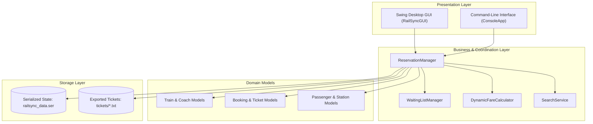

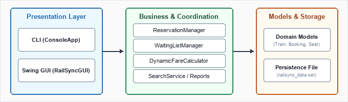

---

### 6.2 Train Search Flowchart

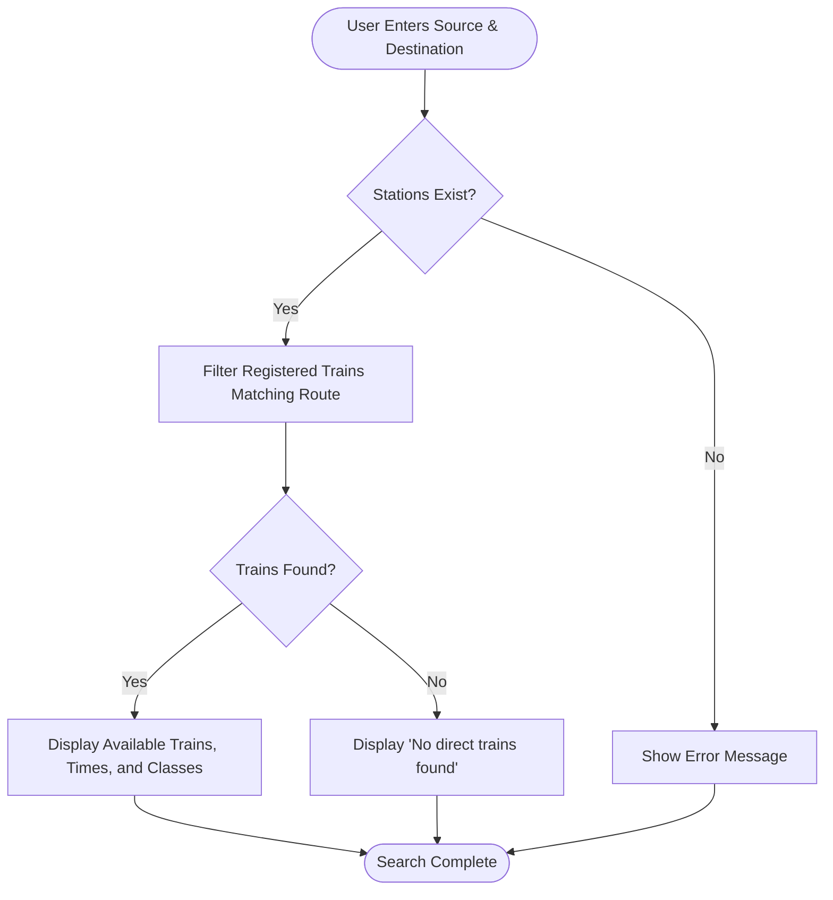


---

### 6.3 Ticket Booking Flowchart

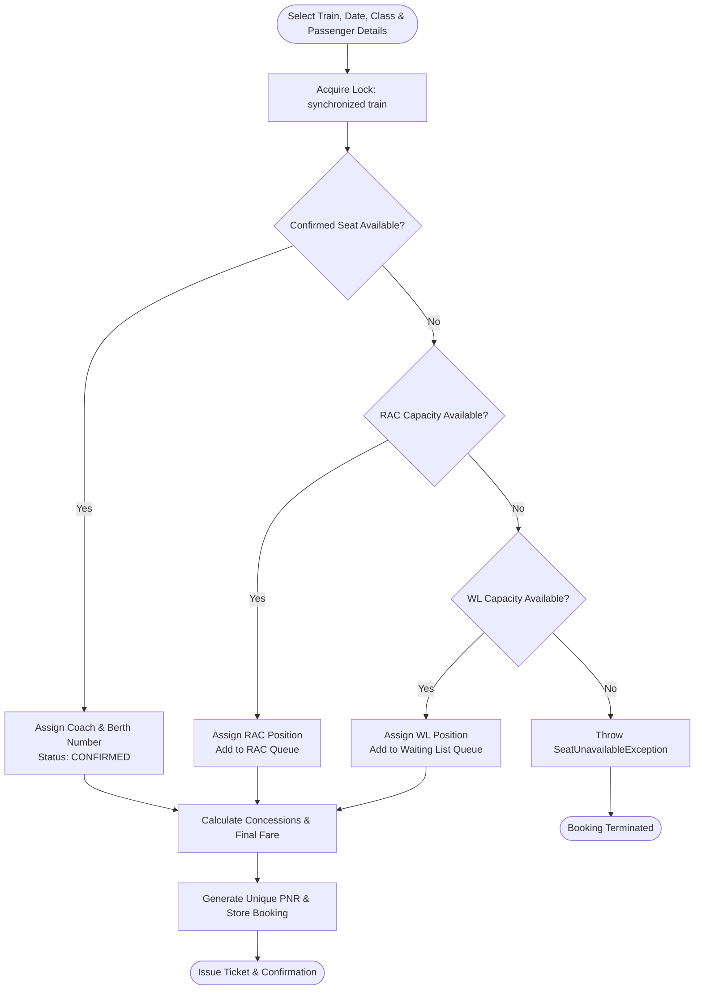

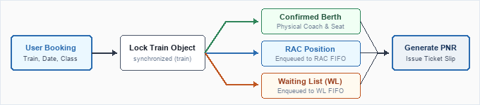

---

### 6.4 Ticket Cancellation & Promotion Cascade Flowchart

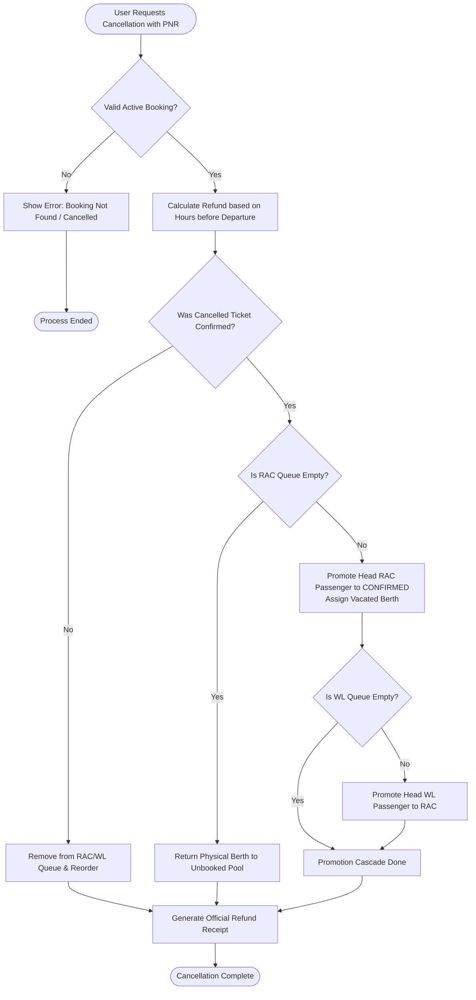

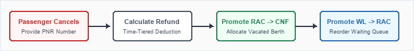

---

## 7. Main Modules

1. **Train Search & Scheduling Module:** Enables route lookups between stations with departure/arrival timings, journey duration, and seat availability.
2. **Booking & Berth Allocation Module:** Processes multi-passenger bookings, assigns coach berth numbers (Lower, Middle, Upper, Side Lower, Side Upper, Window, Aisle), and generates unique PNR numbers.
3. **Queue Management Module:** Implements FIFO queues for RAC and Waiting List passengers when confirmed berths are fully booked.
4. **Dynamic Fare & Concession Engine:** Computes distance-based fares with travel class multipliers, catering fees, and age-based statutory concessions (Senior Citizen 40%, Child 50%, Infant free).
5. **Cancellation & Refund Module:** Computes time-tiered cancellation deductions (10% to 50%) and triggers automatic two-tier queue promotions.
6. **Persistence & Export Module:** Serializes system state to disk and formats electronic reservation slips (tickets) and summary reports.
7. **Concurrency Simulation Module:** Spawns concurrent worker threads booking seats simultaneously to demonstrate that `synchronized` blocks prevent double-booking.

---

## 8. Implementation Details & OOP Concepts

### 8.1 Abstraction and Inheritance
The application defines an abstract class `Train` containing common properties: train number, train name, source, destination, departure time, arrival time, distance, and coach roster. Specialized train categories inherit from `Train`:
- `RajdhaniExpress`: High-speed overnight train with dynamic catering surcharges and premium 1A, 2A, and 3A coaches.
- `ShatabdiExpress`: Daytime express with Chair Car (CC) and Executive 1A seating.
- `VandeBharatExpress`: Semi-high-speed modern train with catering and Chair Car accommodation.
- `SuperfastExpress` & `ExpressTrain`: Intercity long-distance trains featuring Sleeper (SL) and AC coaches.

### 8.2 Polymorphism
Each subclass overrides methods such as `getBaseFareRatePerKm()` and `calculateCateringCharge()` to supply specialized pricing rules. At runtime, the fare calculator polymorphicly evaluates the exact subclass behavior without type-casting.

### 8.3 Thread Safety via Monitor Locks
To prevent race conditions during simultaneous bookings on the same train, seat allocation logic is enclosed inside a fine-grained monitor lock:
```java
synchronized (train) {
    // 1. Search available coach seats
    // 2. Allocate berth or transition to RAC / Waiting List
    // 3. Mark seat as booked
}
```
Synchronizing per-train rather than locking the entire reservation manager allows concurrent bookings on different trains to proceed in parallel without blocking each other.

---

## 9. Testing & Verification

The project includes an automated test runner (`TestRunner.java`) that executes 7 test scenarios validating all critical business rules:

| Test # | Test Case Description | Verified Logic | Result |
|---|---|---|---|
| **Test 1** | Ticket Booking & Seat Allocation | Confirmed booking assigns non-null PNR, coach ID, and berth number. | **PASS** |
| **Test 2** | RAC Allocation upon Full Capacity | When physical seats are full, next booking correctly receives `RAC` status. | **PASS** |
| **Test 3** | Waiting List Allocation & Limit Check | When RAC is full, booking enters `WAITING_LIST`; when WL is full, request is rejected. | **PASS** |
| **Test 4** | Cancellation & Cascade Promotion | Cancelling a confirmed ticket promotes RAC to Confirmed, and WL to RAC. | **PASS** |
| **Test 5** | Fare & Concession Calculation | Correct concession applied for Senior Citizens (40%) and Infants (100%). | **PASS** |
| **Test 6** | Multithreaded Booking Safety | 10 concurrent threads compete for 4 seats; zero duplicate seat assignments occur. | **PASS** |
| **Test 7** | System State Persistence | State is successfully serialized to file, restored to memory, and integrity verified. | **PASS** |

**Verification Summary: 7 Passed, 0 Failed.**

---

## 10. Application Screenshots & Results

The following screenshots are captured from the actual running RailSync application.

### 10.1 Main Menu & Application Start
The interactive terminal application displays the main menu with options for train search, catalog inspection, booking, PNR enquiries, cancellations, queue inspection, and fare calculation.

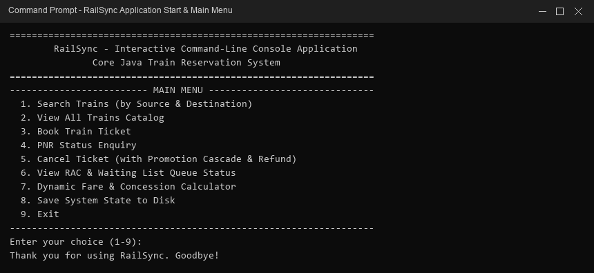

---

### 10.2 Train Route Search
Demonstrates searching for direct trains between New Delhi (`NDLS`) and Mumbai Central (`BCT`), displaying train numbers, departure/arrival schedules, and available seat classes.

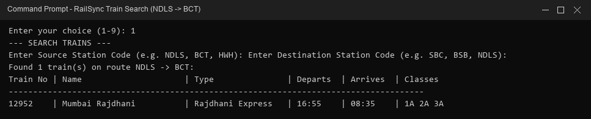

---

### 10.3 Train Fleet Catalog
Displays the complete registered train roster showing routes, train categories, and journey distances.

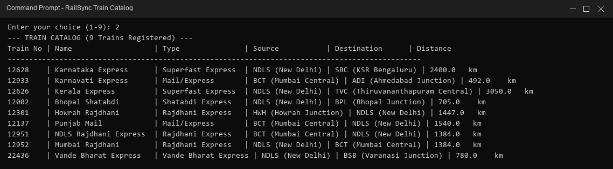

---

### 10.4 Ticket Booking & Seat Allocation
Shows booking a confirmed ticket on the Mumbai Rajdhani (`12952`) in AC First Class (`1A`) with passenger details, Lower Berth allocation (`H1-1`), unique PNR generation, and total fare.

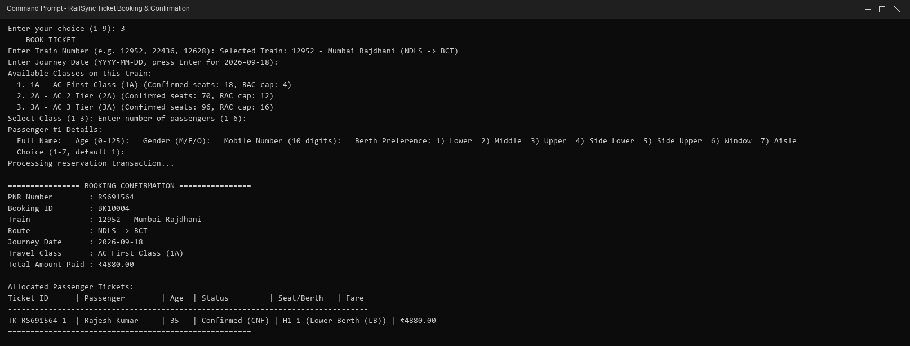

---

### 10.5 PNR Status Enquiry
Shows retrieving a booking record using PNR `RS412404`, displaying passenger manifest, active status, coach, and berth allocations.

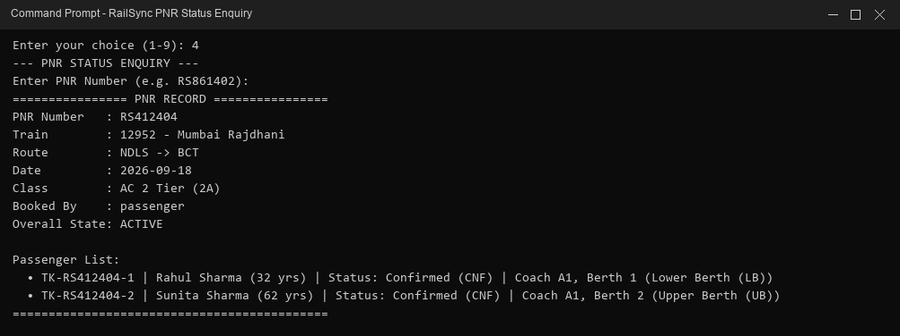

---

### 10.6 Ticket Cancellation & Refund Receipt
Shows cancelling a confirmed ticket and generating an official refund receipt with departure-based cancellation deductions and net refund payable.

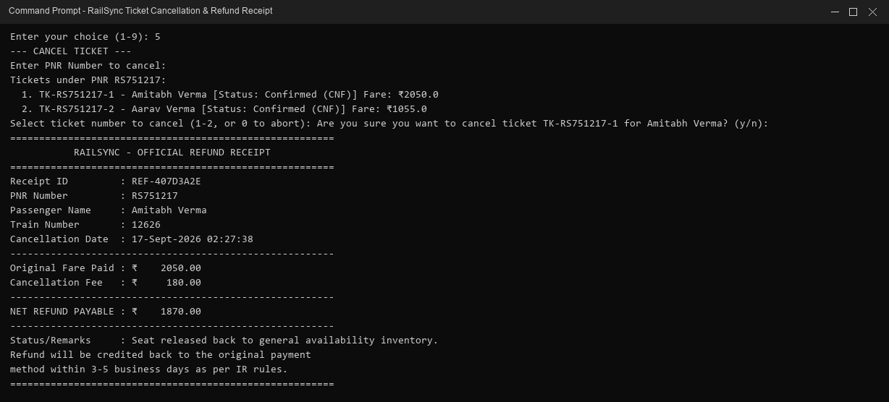

---

### 10.7 RAC and Waiting List Queue Status
Displays live inspection of available confirmed seats, RAC queue capacity, and Waiting List queue capacity across all coach classes for Train 12952.

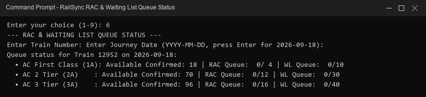

---

### 10.8 Dynamic Fare & Concession Calculation
Shows distance-based fare calculation for a senior citizen passenger on Train 12952 with class multiplier and 40% statutory concession applied.

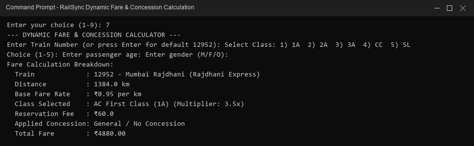

---

### 10.9 Swing Graphical User Interface (Passenger Portal)
Shows the desktop Swing interface for passenger train searching and multi-passenger booking with live fare calculation.

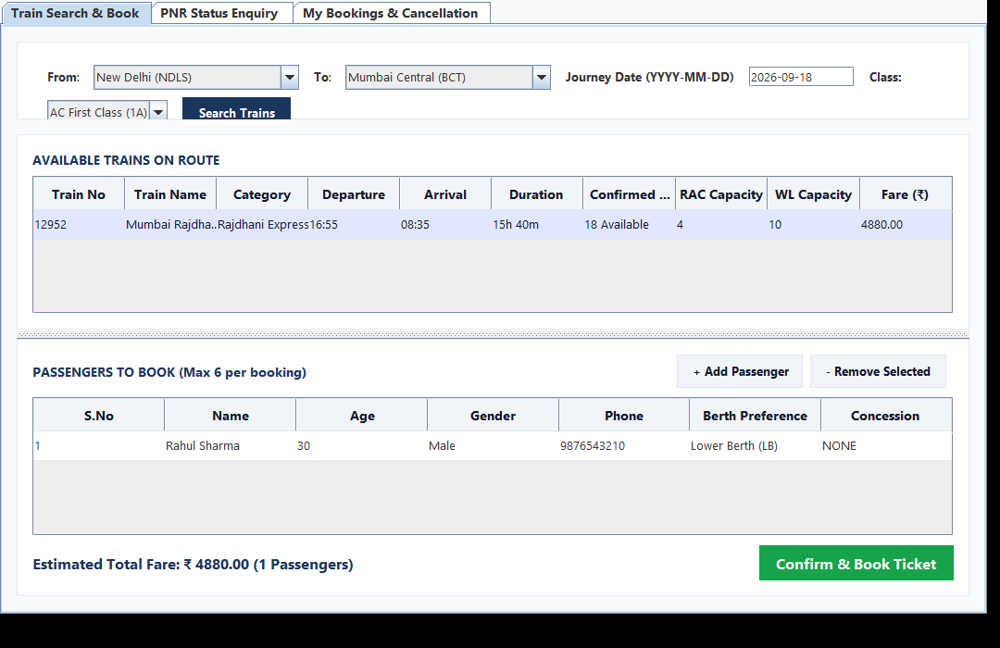

---

### 10.10 Swing Graphical User Interface (Admin Console)
Shows the administrative dashboard displaying fleet statistics, total bookings, confirmed passengers, gross revenue, and class-wise occupancy breakdown.

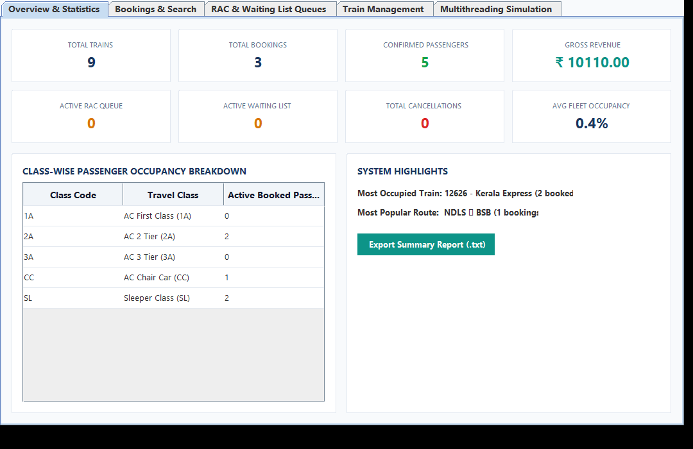

---

### 10.11 Exported Electronic Reservation Slip
Shows the generated text ticket slip exported by the system with complete journey information and passenger berth roster.

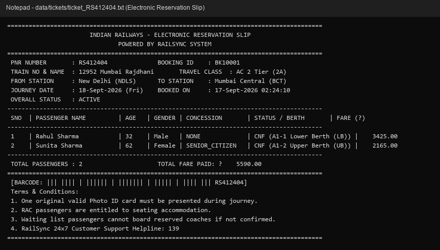

---

## 11. Challenges Faced & Solutions

1. **Race Conditions in Seat Assignment:**
   *Problem:* When multiple threads booked tickets concurrently, non-synchronized checks resulted in two passengers receiving the same berth.
   *Solution:* Implemented fine-grained monitor locks on the individual `Train` object (`synchronized (train)`), ensuring atomicity during seat allocation while allowing concurrent bookings on different trains.

2. **Managing Queue Reordering during Cancellations:**
   *Problem:* Cancelling an RAC ticket required shifting remaining queue positions without breaking FIFO order.
   *Solution:* Utilized `java.util.LinkedList` and iterated through the queue to decrement queue positions sequentially upon removal.

3. **Handling Overnight Journey Durations:**
   *Problem:* Subtracting departure time from arrival time for overnight trains resulted in negative durations.
   *Solution:* Adjusted the duration calculation by adding 24 hours (86,400 seconds) when the arrival time is numerically earlier than departure time.

---

## 12. Conclusion & Key Takeaways

Developing RailSync provided practical experience in designing and building a modular Core Java application:
- **Object-Oriented Design:** Applied abstraction, inheritance, polymorphism, and encapsulation to create a clean, maintainable domain model.
- **Concurrency & Synchronization:** Understood how thread safety is enforced in Java using monitor locks and synchronized blocks.
- **Collections Framework:** Gained hands-on experience selecting appropriate data structures (`HashMap`, `LinkedList`, `ArrayList`) based on operational requirements.
- **GUI Programming:** Built an interactive desktop application using Java Swing with clean separation between UI components and core business logic.

---

## 13. References

1. Oracle Corporation. *The Java™ Tutorials: Learning the Java Language & Concurrency*. Oracle Documentation.
2. Oracle Corporation. *Creating a GUI With JFC/Swing*. Oracle Documentation.
3. Ministry of Railways, Government of India. *Indian Railway Standard Reservation Rules and Commercial Manual*.
4. Horstmann, C. S. *Core Java Volume I – Fundamentals*. Prentice Hall.